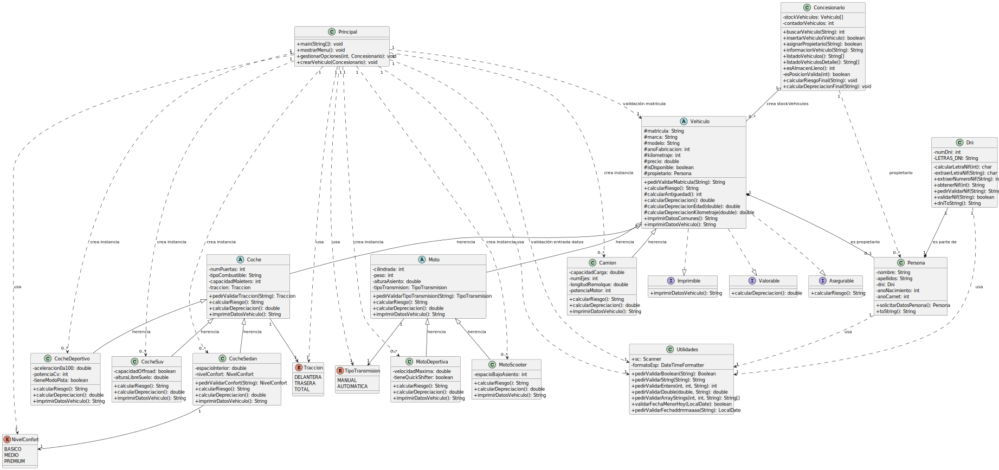

# UT5_ED_Prog
Diagrama de clases
## Tareas

- [x] Crear repositorio en GitHub
- [x] Añadir README.md con checklist
- [x] Clonar el repositorio
- [x] Crear carpeta uml/
- [x] Crear carpeta src/ 
- [x] Crear fichero diagramaclases.puml (estructura inicial)
- [x] Guardar ficheros .java
- [x] Hacer el primer commit y subir al remoto
- [x] Modelar atributos, métodos y relaciones
- [x] Actualizar cambios finales al remoto
- [x] Generar diagrama UML en .svg con PlantUML
- [X] Insertar diagrama en README.md remoto

---
---

